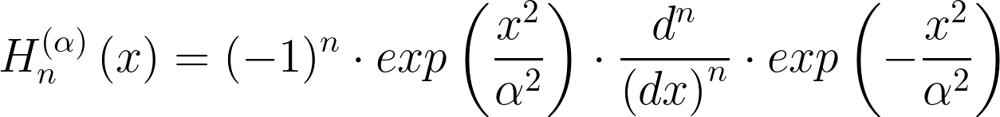
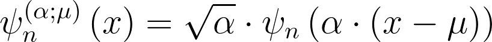
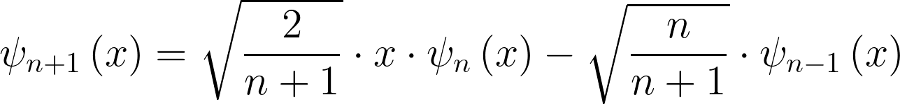

# `robust_hermite_ft`

[](https://www.python.org/downloads/release/python-390/)
[](https://www.python.org/downloads/release/python-3100/)
[](https://www.python.org/downloads/release/python-3110/)
[](https://www.python.org/downloads/release/python-3120/)
[](https://github.com/psf/black)
[](https://pycqa.github.io/isort/)
[](https://codecov.io/gh/MothNik/robust_hermite_ft/branch/10-improve-and-add-coverage-to-CI)
<br><br>

You want to compute the Fourier transform of a signal, but your signal can be corrupted by outliers? If so, this package is for you even though you will have to say goodbye to the _"fast"_ in _Fast Fourier Transform_ 🏃🙅‍♀️

🏗️🚧 👷👷‍♂️👷‍♀️🏗️🚧

Currently under construction. Please check back later.

## ⚙️ Setup and 🪛 Development

### 🎁 Installation

Currently, the package is not yet available on PyPI. To install it, you can clone the repository

```bash
git clone https://github.com/MothNik/robust_hermite_ft.git
```

and from within the repositories root directory, install it with

```bash
pip install -e .
```

for normal use or

```bash
pip install -e .["dev"]
```

for development which will also install the development dependencies.

⚠️ **Warning**: This will require a C-compiler to be installed on your system to
compile the Cython code.

### 🔎 Code quality

The following checks for `black`, `isort`, `pyright`, `ruff`, and
`cython-lint` - that are also part of the CI pipeline - can be run with

```bash
black --check --diff --color ./examples ./src ./tests
isort --check --diff --color ./examples ./src ./tests
pyright
ruff check ./examples ./src ./tests
cython-lint src/robust_hermite_ft/hermite_functions/_c_hermite.pyx
```

### ✅❌ Tests

To run the tests - almost like in the CI pipeline - you can use

```bash
pytest --cov=robust_hermite_ft ./tests -n="auto" --cov-report=xml -x --no-jit
```

for parallelized testing whose coverage report will be stored in the folder
`./htmlcov`.

## 〰️ Hermite functions

Being the eigenfunctions of the Fourier transform, Hermite functions are excellent
candidates for the basis functions for a Least Squares Regression approach to the Fourier
transform. However, their evaluation can be a bit tricky.

The module `hermite_functions` offers a numerically stable way to evaluate Hermite
functions or arbitrary order $n$ and argument - that can be scaled with a factor
$\alpha$:

<p align="center">
  
</p>

The Hermite functions are defined as

<p align="left">
  
</p>

with the Hermite polynomials

<p align="left">
  
</p>

By making use of logarithm tricks, the evaluation that might involve infinitely high
polynomial values and at the same time infinitely small Gaussians - that are on top of
that scaled by an infinitely high factorial - can be computed safely and yield accurate
results.

For doing so, the relation between the dilated and the non-dilated Hermite functions

<p align="left">
  
</p>

and the recurrence relation for the Hermite functions

<p align="left">
  
</p>

are used, but not directly. Instead, the latest evaluated Hermite function is kept at a
value of either -1, 0, or +1 during the recursion and the logarithm of a correction
factor is tracked and applied when the respective Hermite function is finally evaluated
and stored. This approach is based on [[1]](#references).

The implementation is tested against a symbolic evaluation with `sympy` that uses 200
digits of precision and it can be shown that even orders as high as 2,000 can still be
computed even though neither the polynomial, the Gaussian nor the factorial can be
evaluated for this anymore. The factorial for example would already have overflown for
orders of 170 in `float64`-precision.

<p align="center">
  
</p>

As a sanity check, their orthogonality is part of the tests together with a test for
the fact that the absolute values of the Hermite functions for real input cannot exceed
the value $\frac{1}{\pi^{-\frac{1}{4}}\cdot\sqrt{\alpha}}$.

## References

- [1] Bunck B. F., A fast algorithm for evaluation of normalized Hermite
  functions, BIT Numer Math (2009), 49, pp. 281–295, DOI: [https://doi.org/10.1007/s10543-009-0216-1](https://doi.org/10.1007/s10543-009-0216-1)
