# `robust_fourier`

[](https://www.python.org/downloads/release/python-390/)
[](https://www.python.org/downloads/release/python-3100/)
[](https://www.python.org/downloads/release/python-3110/)
[](https://www.python.org/downloads/release/python-3120/)
[](https://github.com/psf/black)
[](https://pycqa.github.io/isort/)
[](http://mypy-lang.org/)
[](https://codecov.io/gh/MothNik/robust_fourier/branch/10-improve-and-add-coverage-to-CI)

[](https://pepy.tech/project/robust_fourier)
<br><br>

You want to compute the Fourier transform of a signal, but your signal can be corrupted by outliers? If so, this package is for you even though you will have to say goodbye to the _"fast"_ in _Fast Fourier Transform_ 🏃🙅‍♀️

## 🎁 Installation

### 🐍☁️ PyPI

The package can be installed from PyPI with

```bash
pip install robust_fourier
```

If speed matters for you, you can also install the package with the optional dependency
`numba`

```bash
pip install robust_fourier[fast]
```

### 🐙📦 GitHub

To install the package from GitHub, you can simply clone the repository

```bash
git clone https://github.com/MothNik/robust_fourier.git
```

For the following commands, a `Makefile` is provided to simplify the process. Its use is
optional, but recommended.<br>
From within the repositories root directory, the package can be installed for normal use

```bash
# ⚠️ first, activate your virtual environment, e.g., source venv/bin/activate

make install
# equivalent to
pip install --upgrade .
```

or for development (with all the development dependencies)

```bash
# ⚠️ first, activate your virtual environment, e.g., source venv/bin/activate

make install-dev
# equivalent to
pip install --upgrade .["dev"]
```

## ⚙️ Setup and 🪛 Development

When working in developer mode, an environment variable has to be added to run certain
scripts.

```
ROBFT_DEVELOPER = true
```

### 🔎 Code quality

The following checks for `black`, `isort`, `pyright`, `mypy`, `pycodestyle`, and
`ruff` - that are also part of the CI pipeline - can be run with

```bash
make black-check
make isort-check
make pyright-check
make mypy-check
make pycodestyle-check
make ruff-check

# or for all at once
make check

# equivalent to
black --check --diff --color ./auxiliary_scripts ./examples ./src ./tests
isort --check --diff --color ./auxiliary_scripts ./examples ./src ./tests
pyright ./auxiliary_scripts ./examples ./src ./tests
mypy ./auxiliary_scripts ./examples ./src ./tests
ruff check ./auxiliary_scripts ./examples ./src ./tests
pycodestyle ./auxiliary_scripts ./examples ./src ./tests --max-line-length=88 --ignore=E203,W503,E704
```

### ✅❌ Tests

To run the tests - almost like in the CI pipeline - you can use

```bash
make test-xmlcov  # for an XML report
make test-htmlcov  # for an HTML report

# equivalent to
pytest --cov=robust_fourier ./tests -n="auto" --cov-report=xml -x --no-jit
pytest --cov=robust_fourier ./tests -n="auto" --cov-report=html -x --no-jit
```

for parallelized testing whose coverage report will be stored in the file
`./coverage.xml` or in the folder `./htmlcov`, respectively.

## 〰️ Hermite Functions

Being the eigenfunctions of the Fourier transform, Hermite Functions are excellent
candidates for the basis functions for a Least Squares Regression approach to the Fourier
transform. However, their evaluation can be a bit tricky.

The module `hermite_functions` offers a numerically stable way to evaluate Hermite
functions or arbitrary order $n$ and argument - that can be scaled with a factor
$\alpha$ and shifted by a constant $\mu$:

<p align="center">
  
</p>

After a slight modification of the definitions in [[1]](#references), the Hermite
functions can be written as

<p align="center">
  
</p>

with the Hermite polynomials

<p align="center">
  
</p>

With `robust_fourier`, the Hermite Functions can be evaluated for arbitrary orders
using the function interface `hermite_function_vander`

```python
import numpy as np
from robust_fourier import hermite_function_vander

ORDER_MAX = 25  # the maximum order of the Hermite Functions
ALPHA = 2.0  # the scaling factor for the x-variable
MU = -2.0  # the shift of the x-variable

X_FROM = -20.0
X_TO = 20.0
NUM_X = 10_001

x_values = np.linspace(start=X_FROM + MU, stop=X_TO + MU, num=NUM_X)
hermite_vander = hermite_function_vander(
    x=x_values,
    n=ORDER_MAX,
    alpha=ALPHA,
    x_center=MU,
    jit=True,  # will only take effect if Numba is installed
)
```

By making use of logarithm tricks, the evaluation that might involve infinitely high
polynomial values and at the same time infinitely small Gaussians - that are on top of
that scaled by an infinitely high factorial - can be computed safely and yield accurate
results.

For doing so, the relation between the dilated and the non-dilated Hermite Functions

<p align="center">
  
</p>

and the recurrence relation for the Hermite Functions

<p align="center">
  
</p>

are used, but not directly. Instead, the latest evaluated Hermite function is kept at a
value of either -1, 0, or +1 during the recursion and the logarithm of a correction
factor is tracked and applied when the respective Hermite function is finally evaluated
and stored. This approach is based on [[2]](#references).

The implementation is tested against a symbolic evaluation with `sympy` that uses 200
digits of precision and it can be shown that even orders as high as 2,000 can still be
computed even though neither the polynomial, the Gaussian nor the factorial can be
evaluated for this anymore. The factorial for example would already have overflown for
orders of 170 in `float64`-precision.

<p align="center">
  
</p>

As a sanity check, their orthogonality is part of the tests together with a test for
the fact that the absolute values of the Hermite Functions for real input cannot exceed
the value $\frac{1}{\sqrt[4]{\pi\cdot\alpha^{2}}}$.

On top of that `robust_fourier` comes with utility functions to approximate some
special points of the Hermite Functions, namely the x-positions of their

- largest root (= outermost zero),
- largest extrema in the outermost oscillation,
- the point where they numerically fade to zero, and
- an approximation of the outermost oscillation (tail) by a conservative Gaussian peak.

```python
import numpy as np
from robust_fourier import hermite_approx

ORDER = 25  # the order of the Hermite Functions
ALPHA = 20.0  # the scaling factor for the x-variable
MU = 150.0  # the shift of the x-variable

X_FROM = -65.0
X_TO = 65.0
NUM_X = 100_001

# 1) the x-positions at which the outermost oscillation fades below machine
# precision
x_fadeout = hermite_approx.x_fadeout(
    n=ORDER,
    alpha=ALPHA,
    x_center=MU,
)
# 2) the x-positions of the largest zeros
x_largest_zero = hermite_approx.x_largest_zeros(
    n=ORDER,
    alpha=ALPHA,
    x_center=MU,
)
# 3) the x-positions of the largest extrema
x_largest_extremum = hermite_approx.x_largest_extrema(
    n=ORDER,
    alpha=ALPHA,
    x_center=MU,
)

# 4) the Gaussian approximation of the outermost oscillation ...
left_gaussian, right_gaussian = hermite_approx.get_tail_gauss_fit(
    n=ORDER,
    alpha=ALPHA,
    x_center=MU,
)
# ... which is solved for the 50% level
x_left_fifty_percent = left_gaussian.solve_for_y_fraction(y_fraction=0.5)
x_right_fifty_percent = right_gaussian.solve_for_y_fraction(y_fraction=0.5)
# ... but can also be evaluated for all x-values
x_values = np.linspace(start=X_FROM + MU, stop=X_TO + MU, num=NUM_X)
left_gaussian_values = left_gaussian(x=x_values)
right_gaussian_values = right_gaussian(x=x_values)

# 5) the Gaussian approximation is also solved for the 1% interval as a more
# realistic (less conservative) approximation of the fadeout point
x_one_percent = hermite_approx.x_tail_drop_to_fraction(
    n=ORDER,
    y_fraction=0.01,
    alpha=ALPHA,
    x_center=MU,
).ravel()

```

<p align="center">
  
</p>

## 🧮 Chebyshev Polynomials

Even though the [Hermite Functions](#〰️-hermite-functions) have some nice properties,
they are not necessarily the best choice for the Fourier transform. Choosing their
scaling parameter $\alpha$ can be a bit tricky.
Therefore [[3]](#references) suggests using Chebyshev polynomials instead. They are
only defined on the interval $[-1, 1]$ and can be scaled and shifted to fit the
interval $[\mu - \alpha, \mu + \alpha]$ like

<p align="center">
  

for the first kind and

<p align="center">
  

for the second kind. In [[3]](#references) the second kind $U$ is used, but the first
kind $T$ is also implemented in `robust_fourier`

```python
import numpy as np
from robust_fourier import chebyshev_polyvander

ORDER_MAX = 10  # the maximum order of the Chebyshev polynomials
ALPHA = 0.5  # the scaling factor for the x-variable
MU = 0.5  # the shift of the x-variable

X_FROM = -0.5
X_TO = 0.5
NUM_X = 10_001

x_values = np.linspace(start=X_FROM + MU, stop=X_TO + MU, num=NUM_X)
chebyshev_vander_first_kind = chebyshev_polyvander(
    x=x_values,
    n=ORDER_MAX,
    alpha=ALPHA,
    x_center=MU,
    kind="first",
    jit=True,  # will only take effect if Numba is installed
)

chebyshev_vander_second_kind = chebyshev_polyvander(
    x=x_values,
    n=ORDER_MAX,
    alpha=ALPHA,
    x_center=MU,
    kind="second",
    jit=True,  # will only take effect if Numba is installed
)

# alternatively, both kinds can be computed in one go because this is how they are
# computed internally to achieve maximum accuracy
(
  chebyshev_vander_first_kind,
  chebyshev_vander_second_kind,
) = chebyshev_polyvander(
    x=x_values,
    n=ORDER_MAX,
    alpha=ALPHA,
    x_center=MU,
    kind="both",
    jit=True,  # will only take effect if Numba is installed
)
```

<p align="center">
  
</p>

## 📈 Fourier Transform

The key to Robust Fourier Transforms by Least Squares Regression is the evaluation of
a suitable function basis at the data points. Since both the
[Hermite Functions](#〰️-hermite-functions) and the
[Chebyshev polynomials](#🧮-chebyshev-polynomials) are limited to a certain interval, it
makes sense to make the form the basis in the frequency rather than the time/space
domain.

A signal whose frequency domain is only nonzero in a particular interval is called
[_band-limited_](https://en.wikipedia.org/wiki/Bandlimiting). An example for this would
be spectra in Fourier Transform Spectroscopy where the signal is only nonzero in a
certain frequency range where, e.g., the light source emits its characteristic
radiation. While the time/space representation of such signals may be infinitely wide
without ever fading to zero, the band-limited nature in the frequency domain allows for
a finite representation by band-limited basis functions.

Now, the only question remaining is how these basis functions are constructed. For this,
the following generic relation between the time/space domain and the frequency domain
representation of such a basis is defined:

<p align="center">
  

with

- $j$ is the order of the basis function,
- $t$ being the independent variable in the time/space domain,
- $\omega$ being the independent variable in the frequency domain, i. e., the angular
  frequency $\omega = 2\cdot\pi\cdot f$ where $f$ is the frequency in Hz or 1/m,
- $\mathcal{F}$ being the Fourier transform operator,
- $\mathcal{F}^{-1}$ being the inverse Fourier transform operator,
- $\lambda_{j}^{\left(\beta;\gamma; t_{0};\omega_{0}\right)}$ being the $j$-th basis
  function in the time/space domain centered at $t_{0}$ and scaled in x-direction by
  $\beta$, and
- $\Lambda_{j}^{\left(\beta;\gamma; t_{0};\omega_{0}\right)}$ being the $j$-th basis
  function in the frequency domain centered at $\omega_{0}$ and scaled in x-direction
  by $\gamma$.

For fitting signals $y\left(t\right)$ defined in the time/space domain, we need to fit
the basis $\lambda_{j}^{\left(\beta;\gamma; t_{0};\omega_{0}\right)}$ to it:

<p align="center">
  

where $n$ is the order of the basis functions and the coefficients $c_{j}$ are obtained
from a Least Squares or Regularized Least Squares Regression, e.g., Ridge or Lasso
Regression.

Subsequently, its Fourier transform $Y\left(\omega\right)$ can then be computed
analytically using $\Lambda_{j}^{\left(\beta;\gamma; t_{0};\omega_{0}\right)}$:

<p align="center">
  

### 🏄 A simple basis based on Hermite Functions

With this in mind, a basis can be constructed using the Hermite Functions starting
from a basis in the frequency domain that is centered at $\omega_{0} = 0$ and scaled by
$\gamma$:

<p align="center">
  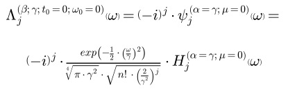

Here, $i=\sqrt{-1}$ is the imaginary unit which is introduced to make the basis in the
purely real-valued time/space domain.

Taking the Inverse Fourier Transform (IFT) yields the basis in the time/space domain,
which turns out to be the Hermite Functions centered at $t_{0} = 0$ and scaled by
$\beta=\frac{1}{\gamma}$:

<p align="center">
  

So, which kind of signals is this basis suitable for? The answer is band-limited signals
that are centered at the origin $t_{0} = 0$ and whose frequencies have nonzero
coefficients only within the interval $\left[-\omega_{u}, \omega_{u}\right]$ where
$\omega_{u}\ge0$ is the upper band limit of the signal.

When fitted with the aforementioned basis, the order $n$ and the scaling factor $\gamma$
determine the point $\omega_{u}$ beyond which the coefficients of the signal are zero.
This point can be approximated as, e.g., the 1% drop off point of the Gaussian tail
approximation of the outermost oscillation as described in the
[Hermite Functions](#〰️-hermite-functions) section.<br>
A similar relation holds for the time/space interval $\left[-t_{u}, t_{u}\right]$ in
which the Hermite functions are effectively nonzero. Its width is determined by the
order $n$ and the scaling factor $\beta$ (i.e., $\gamma$ again). Thus, the width in the
time/space domain can also be approximated in the same fashion.<br>
Independent of the domain, only the highest order $j=n$ has to be considered for the
approximation because the higher the order the wider the Hermite functions become.

<p align="center">
  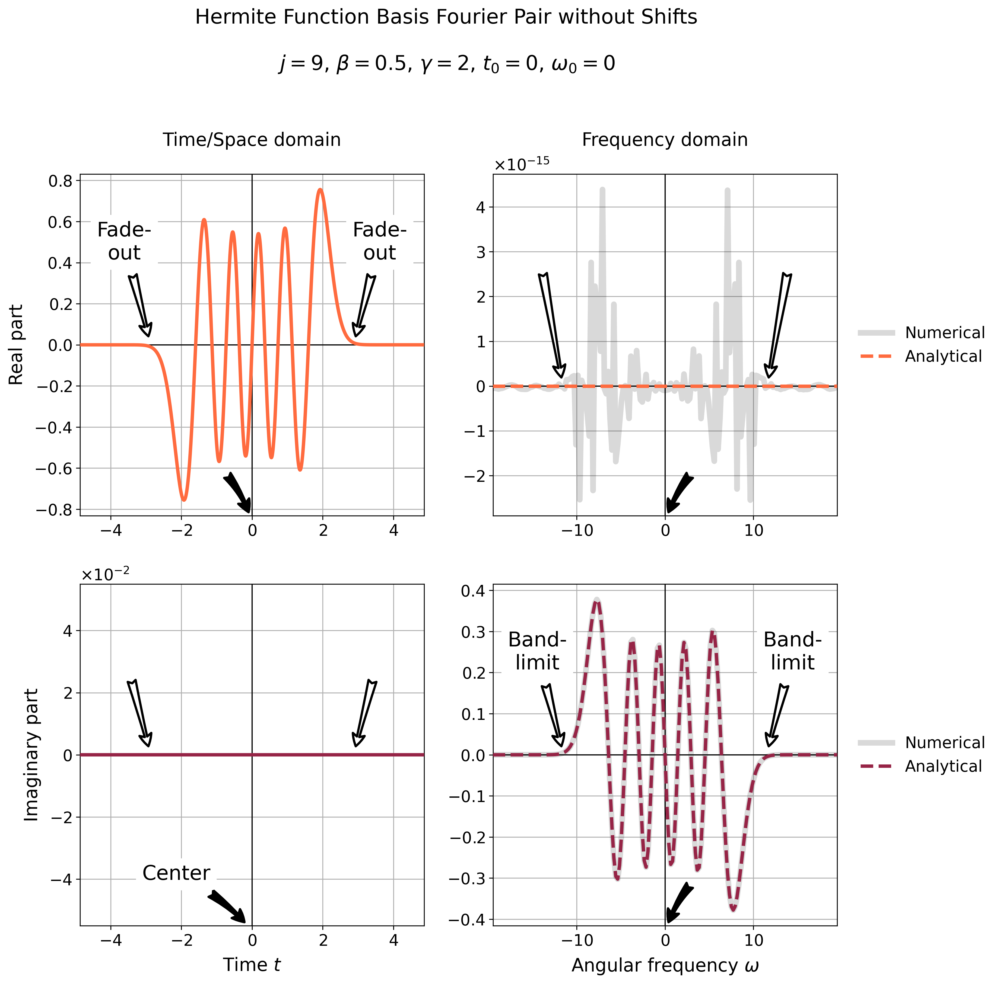

<p align="center">
  

### ⬅️🕰️➡️ Introducing shifts in time and space - A more versatile Hermite Function basis

It's not always the case that the signal is centered at the origin of the time/space
domain. In general, it can be located at any point $t_{0}$ and the basis functions have
to be shifted accordingly.

In the time/space domain, such a shift is achieved in a fairly straightforward manner
by shifting the basis functions to $t_{0}$:

<p align="center">
  

For the frequency domain on the other hand, the shift is a bit more complicated because
it involves the shift property of the Fourier transform which introduces a complex
exponential factor:

<p align="center">
  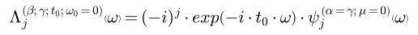

Note that **a shift in the time/space domain introduces a phase shift in the frequency
domain but keeps the center of the basis functions at $\omega_{0}$ unchanged**.

The field of applications remains the same as for
[the simple basis based on Hermite](#🏄-a-simple-basis-based-on-hermite-functions)
except for the fact that now the signal can be located at any point $t_{0}$ which
might be of more practical interest.

Again, the order $n$ and the scaling factor $\gamma$ determine the point $\omega_{u}$
and the interval $\left[t_{0} - t_{u}, t_{0} + t_{u}\right]$ beyond which the frequency
coefficients and the signal are effectively nonzero just as for the simple basis.

<p align="center">
  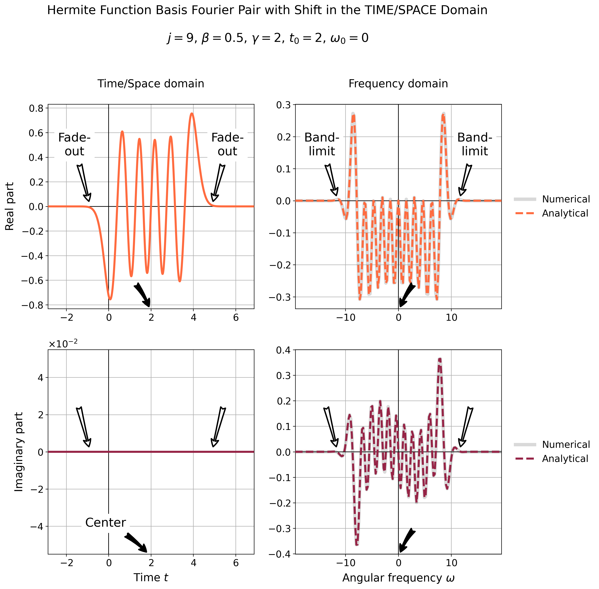

<p align="center">
  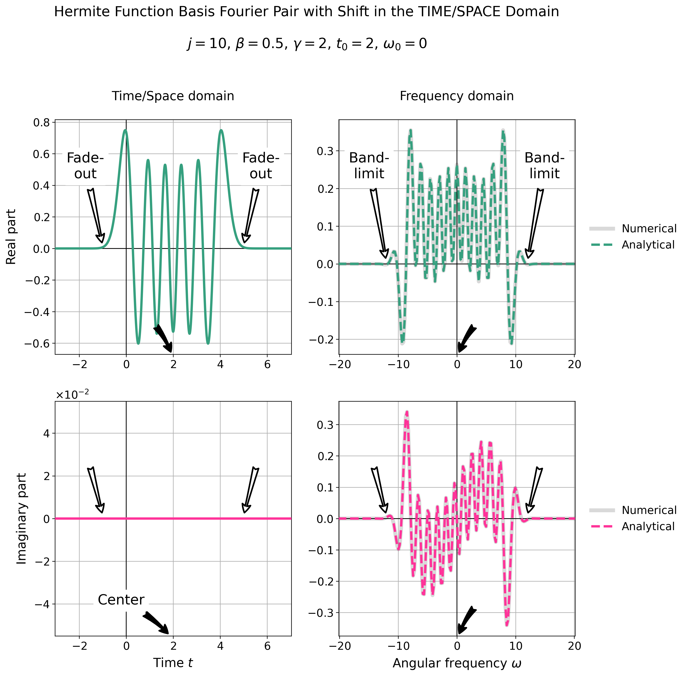

### ⬅️🔊➡️ Shifts in frequency - A mostly useless Hermite Function basis

Not only the time/space domain can be shifted, but also the frequency domain. Assuming
that there is no shift in the time domain, i.e., $t_{0} = 0$, the basis functions in the
frequency domain can be shifted by $\omega_{0}$ by simply shifting the center of the
basis functions:

<p align="center">
  

In analogy to the [previous sections](#⬅️🕰️➡️-introducing-shifts-in-time-and-space---a-more-versatile-hermite-function-basis),
the shift property of the Inverse Fourier Transform (IFT) introduces a complex
exponential factor in the time/space domain - this time with an opposite sign of the
argument:

<p align="center">
  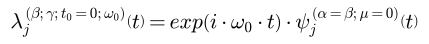

Note that once again **a shift in the frequency domain introduces a phase shift in the
time/space domain but keeps the center of the basis functions at $t_{0}$ unchanged**.

There is not much to be said about this choice of basis functions because their
frequency domain representation is not symmetric around the origin anymore. The even/odd
symmetry of the even/odd order Hermite functions is lost. Therefore, this basis is not
suitable for real signals in the time/space domain whose Fourier transforms show even
symmetry around the origin for the real part and odd symmetry for the imaginary part.

Yet, real signals in the time/space domain are the most common use case. Thus, this
basis has to be extended to its final form by employing a _symmetrization_ that will be
discussed in the next section.

<p align="center">
  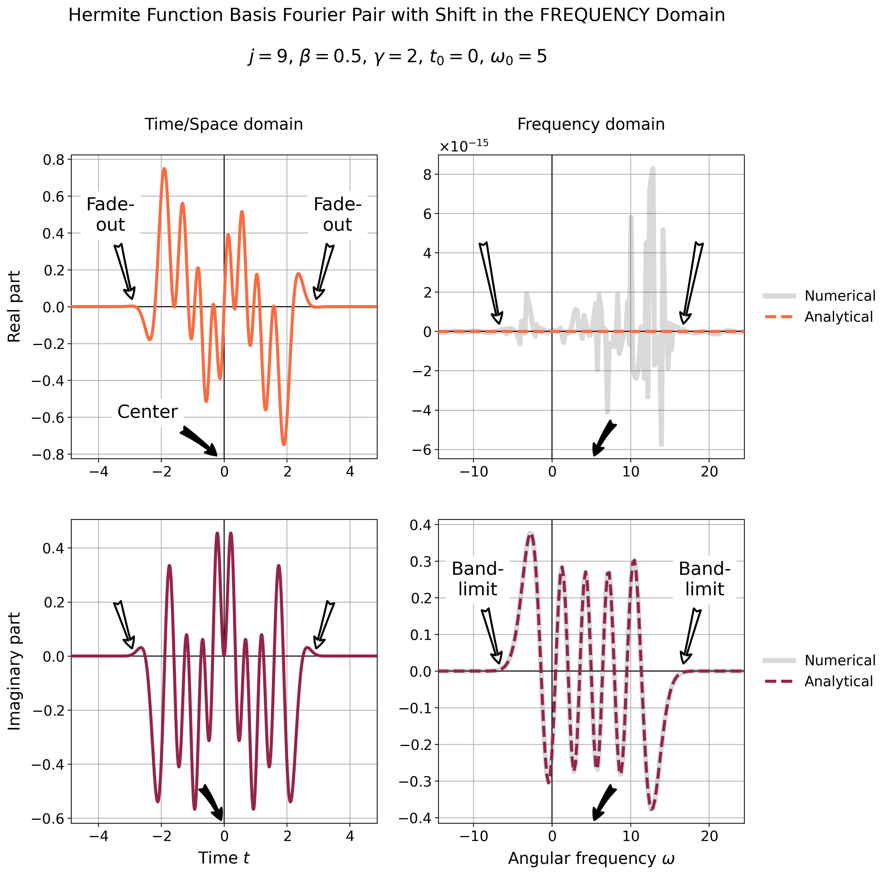

<p align="center">
  

### 📖 Interlude - Euler's formula

Before proceeding, it is worth mentioning Euler's formula which relates the complex
exponential function to the trigonometric functions:

<p align="center">
  

When two of these expressions with opposite sign of the argument are added, the
imaginary parts cancel out and the real parts add up:

<p align="center">
  

For a subtraction on the other hand, the real parts cancel out and the imaginary parts
add up:

<p align="center">
  

This is a very useful property that will be exploited for deriving a very generic basis
with a yet simple analytical form via _symmetrization_.

### 🪞 Symmetrization - The generalized Hermite Function basis

From what was discussed in [the previous sections](#⬅️🔊➡️-shifts-in-frequency---a-mostly-useless-hermite-function-basis),
the problem of a shift in the frequency domain is the loss of symmetry. Such a shift
can nevertheless be advantageous in some cases, e.g., when the signal's frequency
representation only has nonzero coefficients within the intervals
$\left[-\omega_{u},-\omega_{l}\right]$ and $\left[\omega_{l},\omega_{u}\right]$ (due
to symmetry) where $\omega_{l}\ge0$ and $\omega_{u}\ge0$ are the lower and upper band
limits of the signal's frequency representation, respectively. Until now, $\omega_{l}$
was assumed to be 0.

Consequently, some sort of symmetrization has to be applied to the basis functions in
the frequency domain in a manner that makes them cover the relevant range on both the
negative and the positive side of the frequency axis while retaining symmetry. The
following approach for doing so is more oriented towards the final result that should be
achieved rather than mathematical principles.

Let's recall the basis functions that are centered at $\omega_{0}$ in the frequency and
$t_{0}$ in the time/space domain. Given that the basis has to be symmetric in the
frequency domain, $\omega_{0}$ will be restricted to $\omega_{0}\ge0$ without loss of
generality. The time/space domain representation of this basis can be written as

<p align="center">
  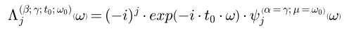

This basis is already sufficient to describe the positive side of the frequency axis
if $n$ and $\gamma$ are chosen such that the basis functions are band-limited to the
interval $\left[\omega_{l},\omega_{u}\right]$. Hence, if the same basis was centered at
$-\omega_{0}$ it would cover the negative counterpart of this interval, namely
$\left[-\omega_{u},-\omega_{l}\right]$:

<p align="center">
  

Fortunately, this basis meets all the symmetry requirements for the negative side of the
frequency axis because all even orders show even symmetry while all odd orders show odd
symmetry. The only thing left to do is to combine the two bases to their final form in
the frequency domain:

<p align="center">
  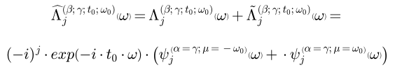

Finally, it's about time to take the Inverse Fourier Transform (IFT) of this basis to
obtain its time/space representation. For this, the linearity property of the IFT, i.e.,
the fact that the IFT of a sum is the sum of the individual IFTs, can be exploited for
the following two expressions:

<p align="center">
  

Admittedly, the sum of this expression will be a bit complicated with the two complex
exponentials, but upon a closer look it becomes evident that the addition expression
derived from [Euler's formula](#📖-interlude---eulers-formula) can be applied for an
extreme simplification after summing up the two bases:

<p align="center">
  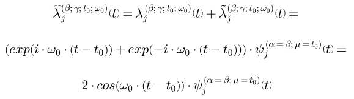

Surprisingly, this basis is relatively simple, especially because it is
**still purely real-valued** in the time/space domain. It is the most general form of
the Hermite Function basis and covers all the previous cases except for the only
one-sided [shift in the frequency domain](#⬅️🔊➡️-shifts-in-frequency---a-mostly-useless-hermite-function-basis).
However, ``robust_fourier`` will only make use of this symmetrized basis when
$\omega_{0}\ne0$.

The order $n$ and the scaling factor $\gamma$ determine the points $\omega_{l}$ and
$\omega_{u}$ that bracket the nonzero coefficients of the signal's frequencies. On the
other hand, they also dictate the interval $\left[t_{0} - t_{u}, t_{0} + t_{u}\right]$
in which the signal is effectively nonzero in the time/space domain.

<p align="center">
  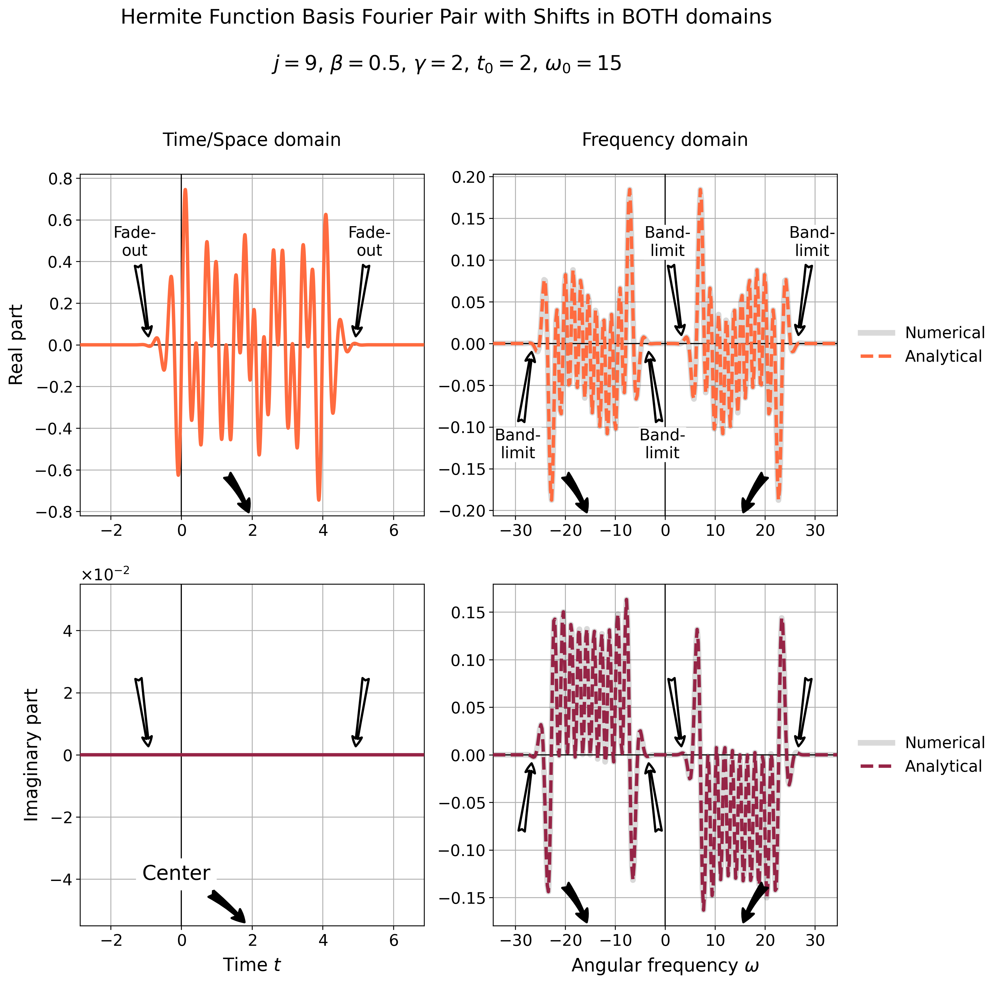

<p align="center">
  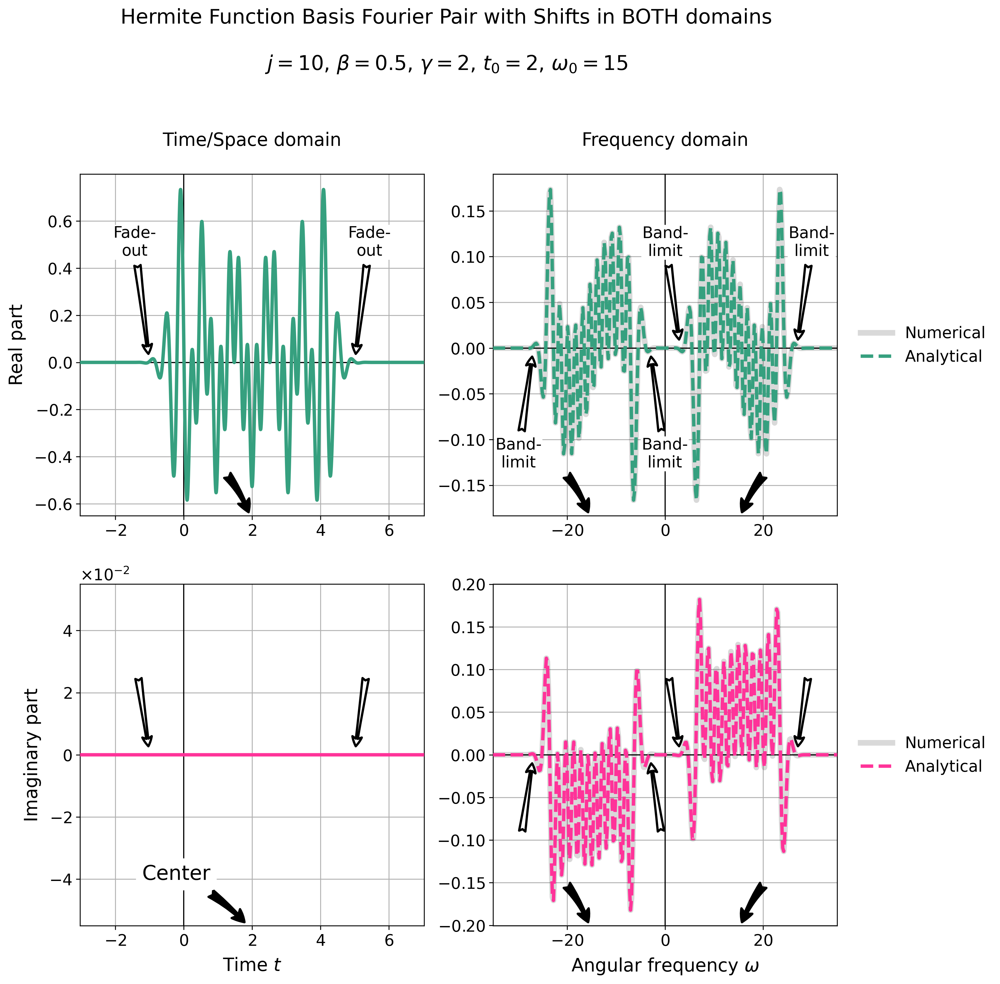

## 🙏 Acknowledgements

This package would not have been possible without the - unfortunately apparently
abandoned - package [`hermite-functions`](https://github.com/Rob217/hermite-functions)
which was a great inspiration for the implementation of the Hermite Functions.

On top of that, I hereby want to thank the anonymous support that patiently listened to
my endless talks about the greatness of Hermite Functions (even though they cannot keep
up with her ❤️‍🔥) and that also helped me to give the plots the visual appeal they have
now 🤩.

## 📖 References

- [1] Dobróka M., Szegedi H., and Vass P., Inversion-Based Fourier Transform as a New
  Tool for Noise Rejection, _Fourier Transforms - High-tech Application and Current Trends_
  (2017), DOI: [http://dx.doi.org/10.5772/66338](http://dx.doi.org/10.5772/66338)
- [2] Bunck B. F., A fast algorithm for evaluation of normalized Hermite functions,
  _BIT Numer Math_ (2009), 49, pp. 281–295, DOI:
  [https://doi.org/10.1007/s10543-009-0216-1](https://doi.org/10.1007/s10543-009-0216-1)
- [3] Al Marashly, O., Dobróka, M., Chebyshev polynomial-based Fourier transformation
  and its use in low pass filter of gravity data, _Acta Geod Geophys_ (2024), 59,
  pp. 159–181 DOI: [https://doi.org/10.1007/s40328-024-00444-z](https://doi.org/10.1007/s40328-024-00444-z)
- [4] Hrycak T., Schmutzhard S., Accurate evaluation of Chebyshev polynomials in
  floating-point arithmetic, _BIT Numer Math_ (2019), 59, pp. 403–416,
  DOI: [https://doi.org/10.1007/s10543-018-0738-5](https://doi.org/10.1007/s10543-018-0738-5)
