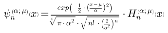
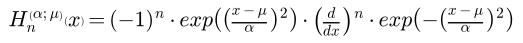
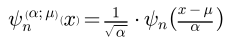
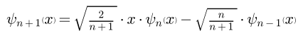

# `robust_hermite_ft`

[](https://www.python.org/downloads/release/python-390/)
[](https://www.python.org/downloads/release/python-3100/)
[](https://www.python.org/downloads/release/python-3110/)
[](https://www.python.org/downloads/release/python-3120/)
[](https://github.com/psf/black)
[](https://pycqa.github.io/isort/)
[](http://mypy-lang.org/)
[](https://codecov.io/gh/MothNik/robust_hermite_ft/branch/10-improve-and-add-coverage-to-CI)

<br><br>

You want to compute the Fourier transform of a signal, but your signal can be corrupted by outliers? If so, this package is for you even though you will have to say goodbye to the _"fast"_ in _Fast Fourier Transform_ 🏃🙅‍♀️

🏗️🚧 👷👷‍♂️👷‍♀️🏗️🚧

Currently under construction. Please check back later.

## ⚙️ Setup and 🪛 Development

### 🎁 Installation

Currently, the package is not yet available on PyPI. To install it, you can clone the repository

```bash
git clone https://github.com/MothNik/robust_hermite_ft.git
```

For the following commands, a Makefile is provided to simplify the process. Its use is
optional, but recommended.<br>
From within the repositories root directory, the package can be installed for normal use

```bash
# activate your virtual environment, e.g., source venv/bin/activate
make install
# equivalent to
pip install --upgrade .
```

or for development (with all the development dependencies)

```bash
# activate your virtual environment, e.g., source venv/bin/activate
make install-dev
# equivalent to
pip install --upgrade .["dev"]
```

⚠️ **Warning**: This will require a C-compiler to be installed on your system to
compile the Cython code.

When working in developer mode, an environment variable has to be added to run certain
scripts.

```
ROBHERMFT_DEVELOPER = true
```

### 🔎 Code quality

The following checks for `black`, `isort`, `pyright`, `ruff`, and
`cython-lint` - that are also part of the CI pipeline - can be run with

```bash
make black-check
make isort-check
make mypy-check
make pyright-check
make pycodestyle-check
make ruff-check
make cython-check

# or for all at once
make check

# equivalent to
black --check --diff --color ./auxiliary_scripts ./examples ./src ./tests
isort --check --diff --color ./auxiliary_scripts ./examples ./src ./tests
pyright ./auxiliary_scripts ./examples ./src ./tests
mypy ./auxiliary_scripts ./examples ./src ./tests
ruff check ./auxiliary_scripts ./examples ./src ./tests
pycodestyle ./auxiliary_scripts ./examples ./src ./tests --max-line-length=88 --ignore=E203,W503
cython-lint src/robust_hermite_ft/hermite_functions/_c_hermite.pyx
```

### ✅❌ Tests

To run the tests - almost like in the CI pipeline - you can use

```bash
make test-xmlcov  # for an XML report
make test-htmlcov  # for an HTML report

# equivalent to
pytest --cov=robust_hermite_ft ./tests -n="auto" --cov-report=xml -x --no-jit
pytest --cov=robust_hermite_ft ./tests -n="auto" --cov-report=html -x --no-jit
```

for parallelized testing whose coverage report will be stored in the file
`./coverage.xml` or in the folder `./htmlcov`, respectively.

## 〰️ Hermite functions

Being the eigenfunctions of the Fourier transform, Hermite functions are excellent
candidates for the basis functions for a Least Squares Regression approach to the Fourier
transform. However, their evaluation can be a bit tricky.

The module `hermite_functions` offers a numerically stable way to evaluate Hermite
functions or arbitrary order $n$ and argument - that can be scaled with a factor
$\alpha$ and shifted by a constant $\mu$:

<p align="center">
  
</p>

After a slight modification of the definitions in [[1]](#references), the Hermite
functions can be written as

<p align="center">
  
</p>

with the Hermite polynomials

<p align="center">
  
</p>

By making use of logarithm tricks, the evaluation that might involve infinitely high
polynomial values and at the same time infinitely small Gaussians - that are on top of
that scaled by an infinitely high factorial - can be computed safely and yield accurate
results.

For doing so, the relation between the dilated and the non-dilated Hermite functions

<p align="center">
  
</p>

and the recurrence relation for the Hermite functions

<p align="center">
  
</p>

are used, but not directly. Instead, the latest evaluated Hermite function is kept at a
value of either -1, 0, or +1 during the recursion and the logarithm of a correction
factor is tracked and applied when the respective Hermite function is finally evaluated
and stored. This approach is based on [[2]](#references).

The implementation is tested against a symbolic evaluation with `sympy` that uses 200
digits of precision and it can be shown that even orders as high as 2,000 can still be
computed even though neither the polynomial, the Gaussian nor the factorial can be
evaluated for this anymore. The factorial for example would already have overflown for
orders of 170 in `float64`-precision.

<p align="center">
  
</p>

As a sanity check, their orthogonality is part of the tests together with a test for
the fact that the absolute values of the Hermite functions for real input cannot exceed
the value $\frac{1}{\sqrt[4]{\pi\cdot\alpha^{2}}}$.

On top of that `robust_hermite_ft` comes with utility functions to approximate some
special points of the Hermite functions, namely the x-positions of their

- largest root (= outermost zero),
- largest maximum in the outermost oscillation, and
- the point where they numerically fade to zero.

<p align="center">
  
</p>

## 📈📉 Fourier transform

When the previous definition of the Hermite function is (arbitrarily) defined to be the
representation of the basis in the time/space domain, their Fourier transform can be
written as

<p align="center">
  
</p>

which is relatively similar to the Hermite functions in the time/space domain, but

- $x$ is replaced by by the angular frequency $\omega = 2\pi\cdot f$,
- the scaling factor $\alpha$ is inverted,
- there is an imaginary prefactor $\left(-j\right)^{n}$, and
- there is another exponential prefactor $e^{-j\cdot\mu\cdot\omega}$ to account for the
  shift $\mu$ in the time/space domain (while there is no shift itself in the frequency
  domain).

Writing all the terms explicitly gives

<p align="center">
  
</p>

This relationship can be proven by comparing the results of the analytical and the
numerical Fourier transform of the Hermite functions - a quality control that is also
part of the test suite.

<p align="center">
  
</p>

## 📖 References

- [1] Dobróka M., Szegedi H., and Vass P., Inversion-Based Fourier Transform as a New
  Tool for Noise Rejection, _Fourier Transforms - High-tech Application and Current Trends_
  (2017), DOI: [http://dx.doi.org/10.5772/66338](http://dx.doi.org/10.5772/66338)
- [2] Bunck B. F., A fast algorithm for evaluation of normalized Hermite functions,
  _BIT Numer Math_ (2009), 49, pp. 281–295, DOI:
  [https://doi.org/10.1007/s10543-009-0216-1](https://doi.org/10.1007/s10543-009-0216-1)
