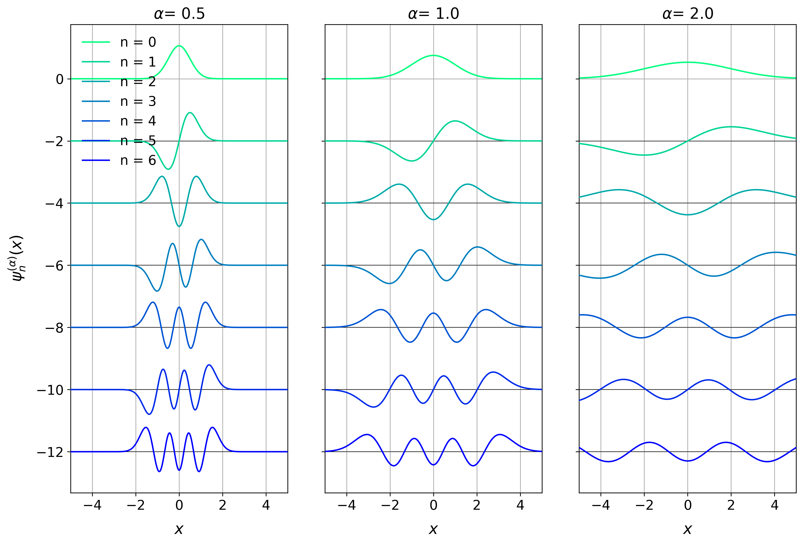
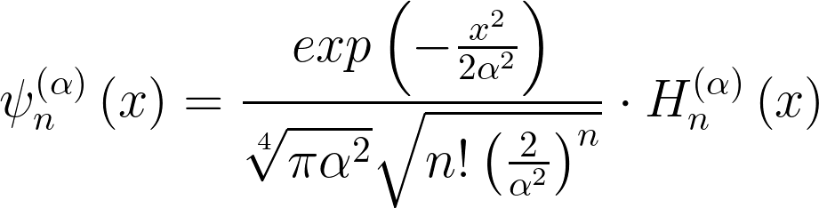
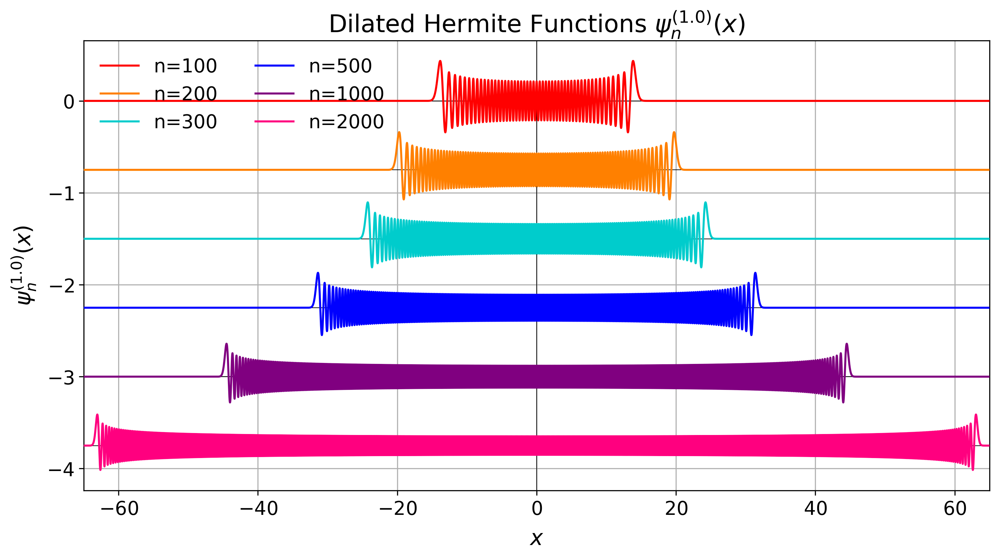

``robust_hermite_ft``
=====================

You want to compute the Fourier transform of a signal, but your signal can be corrupted
by outliers? If so, this package is for you even though you will have to say goodbye to
the *"fast"* in *Fast Fourier Transform* 🏃🙅‍♀️

🏗️🚧 👷👷‍♂️👷‍♀️🏗️🚧

Currently under construction. Please check back later.

〰️ Hermite functions
---------------------

Being the eigenfunctions of the Fourier transform, Hermite functions are an excellent
candidate as the basis functions for a Least Squares Regression approach to the Fourier
transform. However, their evaluation can be a bit tricky.

The module ``hermite_functions`` offers a numerically stable way to evaluate Hermite
functions or arbitrary order :math:`n` and argument - that can be scaled with a factor
:math:`{\alpha}`

The Hermite functions are defined as

By making use of logarithm tricks, the evaluation that might involve infinitely high
polynomial values and at the same time infinitely small Gaussians - that are on top of
that scaled by an infinitely high factorial - can be computed safely and yield accurate
results.

For doing so, the equation is rewritten in logarithmic form as

.. image:: docs/hermite_functions/equations/LogDilatedHermiteFunctions.png
    :width: 902px
    :align: left

where the evaluation of the natural logarithm of the Hermite polynomials is achieved by
making use of the
`logsumexp trick <https://docs.scipy.org/doc/scipy/reference/generated/scipy.special.logsumexp.html>`_.

This approach is tested against a symbolic evaluation with ``sympy`` that uses 100
digits of precision and it can be shown that even orders as high as 2,000 can still be
computed even though neither the polynomial, the Gaussian nor the factorial can be
evaluated for this anymore. The factorial for example would already have overflown for
170 in ``float64``-precision.

As a sanity check, their orthogonality is part of the tests together with a test for
the fact that the absolute values of the Hermite functions for real input cannot exceed
the value :math:`\frac{\pi^{-\frac{1}{4}}}{\sqrt{\alpha}}`.
